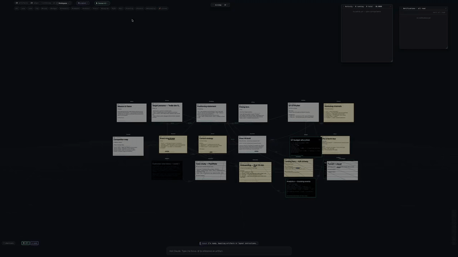

# Interactive Jarvis

> **Concept / prototype.** Like Obsidian, but actually 3D — and like Iron Man's Jarvis, but actually possible now that LLMs are this good. A spatial workspace for working with large bodies of information, where you talk and Claude lays things out for you.

<p align="center">
  
</p>

<p align="center">
  <a href="docs/demo.mp4">📹 Full demo (3 min, MP4)</a> ·
  <a href="docs/ARCHITECTURE.md">Architecture</a> ·
  <a href="docs/AGENTS.md">Agents</a> ·
  <a href="docs/ROADMAP.md">Roadmap</a> ·
  <a href="docs/CONTRIBUTING.md">Contributing</a>
</p>

---

## What it is

A desktop app where you keep a large body of working knowledge as **named cards on a 3D canvas**, and Claude — running locally as a multi-agent system — does the heavy lifting. You ask it to research, write, refine, draw a diagram, group things, lay things out — and it manipulates the canvas directly while you watch.

It's an attempt to build the thing Tony Stark talked to. Now that the model is real, what's missing is the surface — a workspace that respects the way knowledge is actually organized: spatially, by relationship, by salience, not by folder hierarchy.

**Mental model:**

- **Cards** (artifacts) = anything Claude or you produce — docs, notes, code, logs, images, PlantUML/Mermaid diagrams, file attachments.
- **Edges** between cards = `derives` / `references` / `contradicts` / `groups-with`. Drawn by you or by the Layout agent.
- **Clusters** = translucent labelled regions around a set of cards, created by the Layout agent on request.
- **Boards** = independent canvases (projects). Each board has its own cards, edges, bookmarks.
- **Agents** running in the background:
  - **Worker** — handles your text/voice commands. Has full canvas + layout toolset.
  - **Layout** — long-lived; positions cards, draws edges, makes clusters when asked.
  - **Listening** — long-lived; segments your input stream into actionable utterances (still a stub — voice pipeline is best-effort, see Roadmap).
  - **Naming** — short tasks; gives cards short distinctive `@shortName`s.
- **Authentication via Claude Code session** — no API key needed if you've run `claude login` (Pro/Max). Direct API key also works.
- **Filesystem sync** — every card mirrors to `<userData>/boards/<id>/artifacts/<shortName>.md|.ts|...`. Edit in your IDE, watcher pushes back into the canvas. Optional auto-commit via git per board.

---

## Status

This is a **personal-tool prototype** I built for myself, deliberately ambitious in scope. It works end-to-end: 3D canvas, drag/connect/cluster, model selector, undo, multi-board, filesystem sync, PlantUML/Mermaid rendering, agent orchestration. It's also full of rough edges. Voice input via Web Speech is best-effort (Chromium routes through Google's API, often unavailable in Electron — local Whisper is on the roadmap). Performance with 100+ cards needs work. There's no test suite.

If the idea resonates — **PRs are very welcome**. See [CONTRIBUTING.md](docs/CONTRIBUTING.md) and the [Roadmap](docs/ROADMAP.md).

---

## What you can do

| Action | How |
| --- | --- |
| Ask Claude to write/research | type in the bar at the bottom (`/` to focus, `@cardName` to reference an existing card) |
| Drop a file or paste an image | becomes an attachment artifact with auto-detected type |
| Move a card | shift-drag (auto-pins it; layout agent will skip pinned cards) |
| Connect two cards | select 2+, press `E` (references) or `1`/`2`/`3`/`4` (derives/refs/contradicts/groups) |
| Inspect / edit content | double-click any card → markdown rendered, edit in place, refine via Claude, make highlights from selections |
| Reorganize the whole canvas | `Cmd+L` → `by type` / `by tags` / `by topic` / `by time` / `custom…` — handed off to Layout agent. Old clusters wiped, new ones created. |
| Restore a previous layout | `Cmd+L → ↶ restore previous` (history stack of 10) |
| Switch model per agent role | `◐ Sonnet 4.6 ▾` button in top bar — Worker/Layout/Listening/Naming each independently selectable |
| Top-down 2D mode | `T` |
| Frame all / Search / Bookmarks | `F` / `Cmd+F` / `Shift+1..9` save, `1..9` jump |
| Multi-canvas | `▢ Workspace ▾` top-left → switcher / `+ New board` |
| Diagrams in cards | put `@startuml ... @enduml` or fenced ```` ```mermaid ```` in body — rendered in Inspector |

Full keyboard map: click `? shortcuts` bottom-left, or see [docs/SHORTCUTS.md](docs/SHORTCUTS.md).

---

## Stack

- **Electron 32** (TypeScript, electron-vite) — main + preload + renderer split, contextIsolation, ESM
- **React 18 + Three.js / @react-three/fiber + drei** — renderer, custom edges with spring physics
- **`@anthropic-ai/claude-agent-sdk`** — pinned `0.2.136`. Each agent is a separate `query()` call; long-lived agents use streaming-input mode and `setModel()` for live model swap.
- **In-process MCP servers** — `canvas-tools` / `layout-tools` / `listening-tools`. Tools mutate the same in-memory `WorldState` that the renderer subscribes to via IPC.
- **better-sqlite3** + WAL — single source of truth (boards, artifacts, edges, actions, bookmarks, notifications, app_state).
- **chokidar + simple-git** — two-way filesystem sync per board, optional auto-commits.
- **fuse.js** — fuzzy search.
- **plantuml-encoder + mermaid (CDN ESM)** — diagram rendering.

---

## Run

```bash
git clone https://github.com/<you>/interactive-jarvis.git
cd interactive-jarvis
npm install
npm run rebuild              # native rebuild for better-sqlite3 against Electron's Node ABI
JARVIS_SEED_MOCKS=1 npm run dev
```

That seeds a 19-card marketing-strategy demo board with edges and a PlantUML funnel diagram, and opens the Electron window. Existing `claude login` session is auto-used; otherwise set `ANTHROPIC_API_KEY`.

To start blank, omit `JARVIS_SEED_MOCKS=1`.

For browser-only preview of the renderer (no agents), Vite serves at `http://localhost:5173/` — a mock IPC kicks in and you'll see the seed cards without any backend.

---

## Why now

LLMs got good enough that the bottleneck is no longer reasoning — it's the **interface** between human intent and the model's growing toolset. Folders and chat-windows are the wrong unit. The cards-and-relationships model is closer to how working memory actually feels, and 3D gives you depth-as-time and cluster-as-region without forcing the cleanup pass that 2D mind-maps require.

This is one shape of that interface. Probably not the right one. Build a different one.

---

## License

MIT — see [LICENSE](LICENSE).

PRs and forks welcome. If you build something different from the same starting point, link it back.
